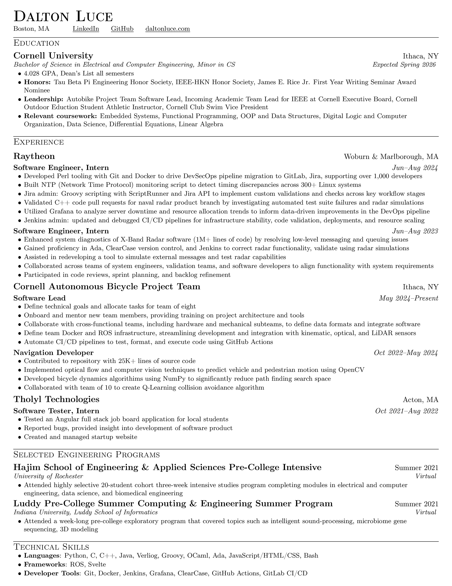

# 📄 CV

My Curriculum Vitae (CV) and a cover letter template written using LaTeX.

## Building

```bash
pdflatex cv.tex
# or
pdflatex cover_letter.tex
```

## Screenshots

### Curriculum Vitae



### Cover Letter


