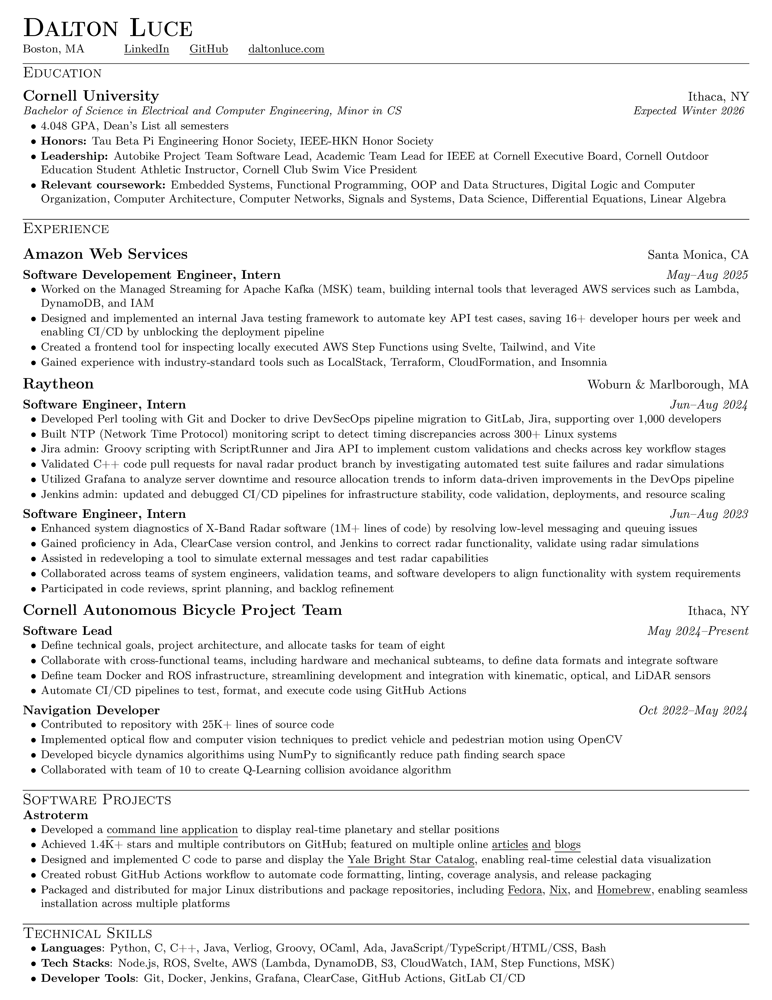
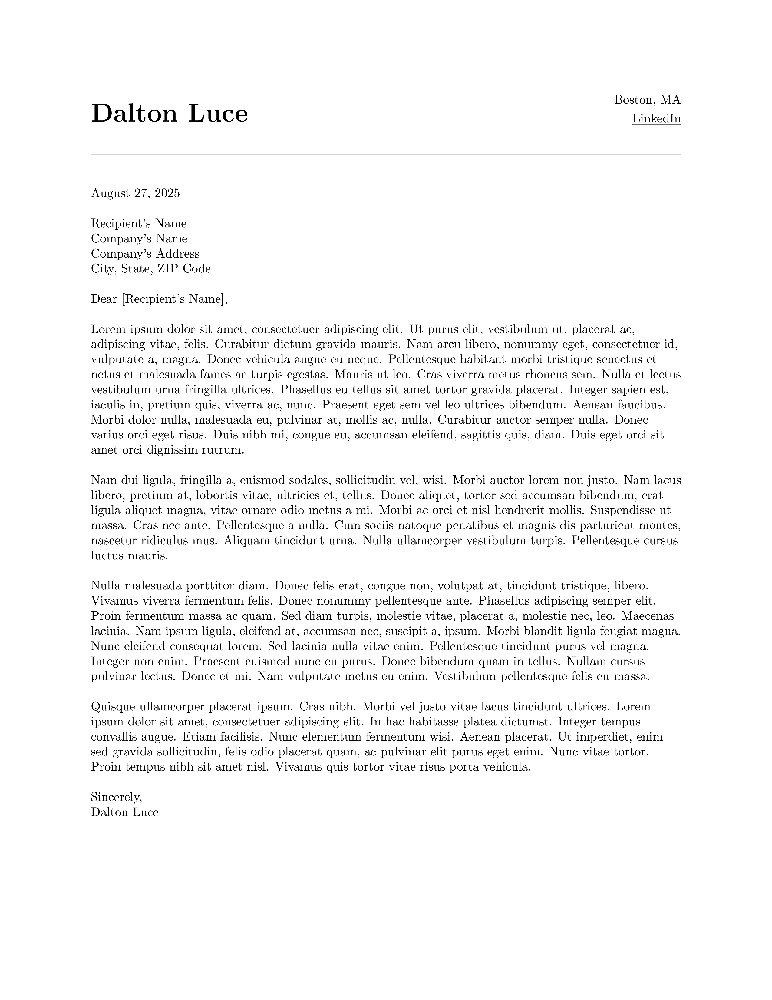

# 📄 CV

My Curriculum Vitae (CV) and a cover letter template written using LaTeX.

## Building

> [!NOTE]
> Requires `pdflatex` and `imagemagick` (for image generation). On macOS, you can install them with:
>
> ```shell
> brew install basictex imagemagick
> ```
>
> Then reload your terminal to ensure the binaries are in your PATH.

1. Install Python dependencies for testing:

    ```shell
    make install
    ```

    ```shell
    source .venv/bin/activate
    ````

2. Build all outputs

    ```shell
    # Build everything (CV + cover letter + images)
    make all
    ```

    To view other available targets, run `make help`.

## Screenshots

### Curriculum Vitae



### Cover Letter



## To be Implemented

- [ ] GitHub action to only generate new PDFs/Images on `main` to reduce repo size
- [x] A more standard build process that works on any OS (✅ Makefile added)
- [x] Migrate from requirements.txt to pyproject.toml for Python dependencies
